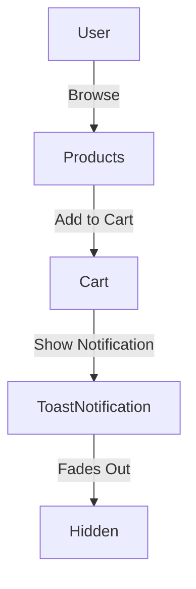

# 🛒 EverMall - Ecommerce Website


## 🌟 Overview

EverMall is a **simple frontend-based ecommerce website** where users can **browse products, add them to their cart, and simulate a checkout process**. The project is **static**, meaning it does not use a backend, database, or payment integration.

## 🎯 Features

✅ **Product Listing** - Browse various product categories  
✅ **Shopping Cart** - Add, remove, and update cart items  
✅ **Cart Toast Notification** - "Added to Cart" message with animated stars  
✅ **Mobile Responsive** - Optimized for all screen sizes  
✅ **User-Friendly UI** - Intuitive design for easy navigation  

## 🔧 Technologies Used

| Tech Stack | Description |
|------------|-------------|
| **Frontend** | HTML, CSS, JavaScript |
| **Styling** | Custom CSS, Boxicons |
| **Interactivity** | Vanilla JavaScript |

## 🚀 Installation & Setup

### 1️⃣ Clone the Repository
```sh
git clone https://github.com/PLP-WebTechnologies/safaricom-hook-final-project-and-deployment-week-8-J-Nyarangi.git
cd safaricom-hook-final-project
```

### 2️⃣ Open the Project
Simply open `index.html` in your browser.
OR, if you have **Live Server (VS Code Extension)** installed:

```sh
npx live-server
```

## 📊 Project Flow

### User Flow



## 🎨 Screenshots

### 1️⃣ Homepage
[Add homepage screenshot here]

### 2️⃣ Product Page
[Add product page screenshot here]

## 📬 Contribution Guidelines

We welcome contributions! Follow these steps:

1. **Fork the repository**
2. **Create a feature branch** (`git checkout -b feature-name`)
3. **Commit your changes** (`git commit -m "Added new feature"`)
4. **Push to your branch** (`git push origin feature-name`)
5. **Open a Pull Request**

## 📜 License

This project is **open-source** under the MIT License.

## 📬 Contact & Support

For any issues or contributions, reach out:
- 📧 Email: **contact@evermall.com**
- 📌 GitHub Issues: [Report Issues](link-to-issues)

## 🚀 Future Enhancements

- Add product search functionality
- Implement product filtering
- Add user wishlist feature
- Enhance mobile responsiveness
- Add product reviews and ratings

---

🛍️ **Enjoy shopping with EverMall!** 🚀