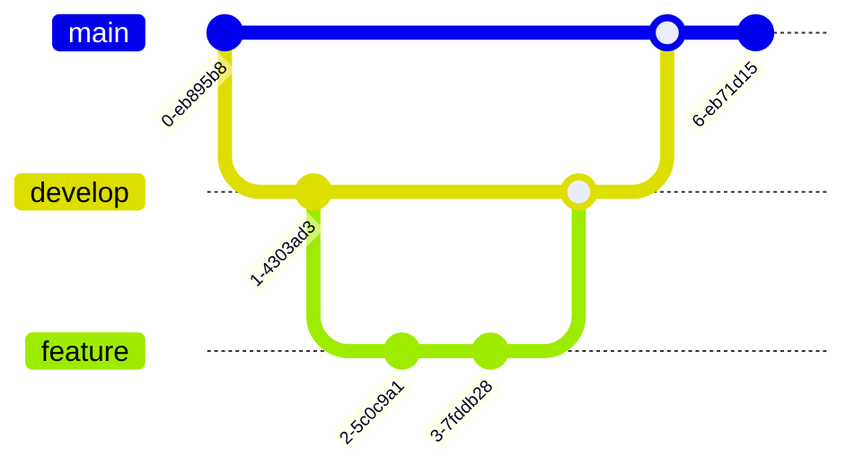

# 🛒 EverMall - Ecommerce Website

EverMall is a **simple frontend-based ecommerce website** where users can **browse products, add them to their cart, and simulate a checkout process**. Built with **HTML, CSS, and JavaScript**.

## 🌐 Live Site  
🔗 **[Visit EverMall](https://evermall.netlify.app)**  

---

## 🏗️ Project Architecture


---

## 🎯 Features

### **CSS Features**
- **Global Styling**: Uses Google Fonts (Poppins) and CSS variables for theming.
- **Animations & Effects**: 
  - Smooth transitions (`transition: all 0.3s ease;`).
  - Scroll behavior (`scroll-behavior: smooth;`).
  - Shadows and gradients for UI depth.
- **Responsive Design**:
  - Grid-based layout for product display.
  - Mobile-first approach with flexbox.
- **Custom Components**:
  - Accordion for FAQ section.
  - Styled buttons and hover effects.

### **JavaScript Features**
- **Navbar Toggle**: Opens and closes the menu (`menu.classList.toggle`).
- **Cart Interactivity**: 
  - Adds items to the cart.
  - Updates cart UI.
  - Handles cart closing.
- **FAQ Accordion**: Expands/collapses FAQ sections with smooth animations.


---

### **Layout & Design**
- Responsive grid layout for products  
- Customizable product card designs  
- Simple and intuitive UI  
- Mobile-optimized  

---

## 🔧 Technologies Used

| Tech Stack  | Description |
|-------------|-------------|
| **Frontend**  | HTML, CSS, JavaScript |
| **Styling**  | Custom CSS, Boxicons |
| **Interactivity** | Vanilla JavaScript |

---

## 🚀 Installation & Setup

### 1️⃣ Clone the Repository
```sh
git clone https://github.com/PLP-WebTechnologies/safaricom-hook-final-project-and-deployment-week-8-J-Nyarangi.git
cd safaricom-hook-final-project
```

### 2️⃣ Open the Project
Simply open **`index.html`** in your browser.

OR, if you have **Live Server (VS Code Extension)** installed:
```sh
npx live-server
```

---

## 📊 User Flow


---

## 📝 Contribution Guidelines

We welcome contributions! Follow these steps:

1️⃣ **Fork the repository**  
2️⃣ **Create a feature branch** (`git checkout -b feature-name`)  
3️⃣ **Commit your changes** (`git commit -m "Added new feature"`)  
4️⃣ **Push to your branch** (`git push origin feature-name`)  
5️⃣ **Open a Pull Request**  

---

## 🚀 Future Enhancements

- Add product search functionality 🔍 
- Implement product filtering by category and price  
- Add user wishlist feature 💖  
- Enhance mobile responsiveness 📱  
- Add product reviews and ratings 🌟  

---

## 🔥 Project Flow

### **Getting Started with Git**



---

## 📬 Contact & Support

For any issues or contributions, reach out:  
📧 Email: **contact@evermall.com**  
📌 GitHub Issues: [Report Issues](https://github.com/PLP-WebTechnologies/safaricom-hook-final-project/issues)

---

## 📜 License

This project is **open-source** under the [MIT License](LICENSE).

---
🛍️ **Enjoy shopping with EverMall!** 🚀
